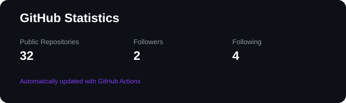

<div align="center">

# Hi, I'm Sneha Pankhi 👋

### `AI/ML • Software Development • Building Practical Systems`


<br><br>

<a href="https://github.com/snehapankhi05">

</a>

<a href="https://www.linkedin.com/in/sneha-pankhi/">

</a>

<a href="mailto:techsneha19@gmail.com">

</a>

<br><br>


</div>

---

## 👩‍💻 About Me

I'm **Sneha Pankhi**, a final-year **Computer Science & Engineering (AIML)** student who enjoys building software that solves practical problems.

My primary interest is **AI/ML**, especially **Generative AI, LLM applications, RAG and Agentic AI**. At the same time, I don't want to limit myself to only the AI layer.

I enjoy working across the stack — from building interfaces and backend APIs to working with databases and integrating intelligent systems into applications.

- 🤖 Exploring **Generative AI, LLMs, RAG & Agentic AI**
- 🧠 Building and experimenting with **AI-powered applications**
- ⚙️ Working with **APIs, backend systems & databases**
- 🌐 Interested in **full-stack application development**
- 🧩 Practicing **DSA & problem solving**
- 🚀 Exploring how AI can be applied to **real-world problems**
- 📚 Currently in **Semester 7**, continuously learning by building

> **I don't want to just build models or chatbots. I want to understand the complete system around them.**

---

## 🧠 What I Work With

<table>
<tr>
<td width="50%" valign="top">

### 🤖 AI / Machine Learning

- Generative AI
- Large Language Models
- Agentic AI
- Retrieval-Augmented Generation
- NLP
- AI Assistants
- Prompt Engineering
- AI Automation
- LangChain
- LangGraph

</td>

<td width="50%" valign="top">

### 💻 Software Development

- Python
- C / C++
- Java
- JavaScript
- HTML
- CSS
- REST APIs
- FastAPI
- Git & GitHub
- VS Code

</td>
</tr>

<tr>
<td width="50%" valign="top">

### 🗄️ Data & Backend

- SQL
- Databases
- MongoDB
- MySQL
- API Integration
- Data Handling
- Backend Development
- Vector Databases
- FAISS

</td>

<td width="50%" valign="top">

### 🌐 Development Focus

- Full-Stack Applications
- Backend Systems
- AI Integration
- Database-Driven Applications
- API Development
- Automation
- Problem Solving
- System Thinking

</td>
</tr>
</table>

---

## 🛠️ Technologies

<p align="center">


</p>

<p align="center">


</p>

---

## 🚀 Featured Projects

I prefer building projects where different parts of software engineering come together rather than isolated tutorials.

### 🤝 HireAlign

An AI-focused project exploring how intelligent systems can assist with the hiring and candidate-alignment process.

**Focus:** `AI/ML` `Generative AI` `Automation` `Real-World Problem Solving`

---

### 🎥 YouTube AI Assistant

An AI application designed to make long-form YouTube content easier to understand, search and interact with.

**Focus:** `LLMs` `NLP` `RAG` `Information Retrieval`

---

### 📄 PDF Assistant

A document-based AI assistant that allows users to interact with PDF content using natural language.

**Focus:** `RAG` `LLMs` `PDF Processing` `Vector Search`

---

### 🤖 AI Chatbot

A conversational AI application exploring LLM-powered conversations, backend integration and persistent application data.

**Focus:** `LLMs` `LangChain` `LangGraph` `Backend` `Database`

---

### 🏥 Insurance Premium Prediction API

A machine-learning project taken beyond model training into an API-based application.

**Focus:** `Machine Learning` `Python` `FastAPI` `REST API`

---

### 🔬 AI Research Agent — Coming Soon

An upcoming project exploring how an **agentic system** can approach research as a multi-step task instead of simply answering a prompt.

The idea is to experiment with an agent that can:

`Understand → Plan → Search → Gather → Reason → Synthesize`

**Status:** `Exploring → Building`

---

## 🧩 How I Like Building

```text
                    REAL-WORLD PROBLEM
                           │
                           ▼
                    ┌──────────────┐
                    │   Frontend   │
                    └──────┬───────┘
                           │
                           ▼
                    ┌──────────────┐
                    │  Backend/API │
                    └──────┬───────┘
                           │
              ┌────────────┴────────────┐
              ▼                         ▼
       ┌──────────────┐          ┌──────────────┐
       │   Database   │          │   AI / ML    │
       └──────────────┘          └──────┬───────┘
                                        │
                                        ▼
                               ┌─────────────────┐
                               │  LLM / Agent   │
                               └─────────────────┘
```

I'm interested in understanding how these pieces connect to turn an idea into a usable application.

---

# 📊 GitHub Analytics

## 📈 GitHub Activity

<p align="center">


</p>

---

## 💻 GitHub Statistics

<p align="center">



</p>

---


## 🐍 Contribution Snake

<p align="center">

<picture>
    <source media="(prefers-color-scheme: dark)" srcset="./assets/snake-dark.svg">
    <source media="(prefers-color-scheme: light)" srcset="./assets/snake.svg">
    
</picture>

</p>

---

## 💻 Problem Solving

<p align="center">

<a href="https://leetcode.com/u/Snehapankhi195/">

</a>

</p>

I'm continuously working on **DSA and problem solving** alongside development and AI.

---

## 🌱 Currently Exploring

```text
AI / ML
├── Generative AI
├── LLM Applications
├── RAG
├── Agentic AI
├── LangGraph
└── AI Automation

Software Engineering
├── Backend Development
├── REST APIs
├── Databases
├── Full-Stack Applications
└── System Design Fundamentals
```

---

## ⚡ Beyond the Code

- 🔍 I like taking an idea and figuring out **how it could actually work in the real world**.
- 🧩 I enjoy projects where AI has to interact with other parts of a system.
- 🚀 I learn best by building, debugging and improving real projects.
- 🧠 I'm currently exploring the space between **AI research and practical software engineering**.
- ☕ Still trying to decide whether the bug is in my code or in my understanding of the code.

---

## 🤝 Let's Connect

<div align="center">

I'm always interested in **AI, software development, interesting projects and learning from other builders.**

<br>

<a href="https://www.linkedin.com/in/sneha-pankhi/">LinkedIn</a>
&nbsp;&nbsp;•&nbsp;&nbsp;
<a href="https://github.com/snehapankhi05">GitHub</a>
&nbsp;&nbsp;•&nbsp;&nbsp;
<a href="mailto:techsneha19@gmail.com">Email</a>

<br><br>

### `Build • Learn • Experiment • Improve`

</div>
